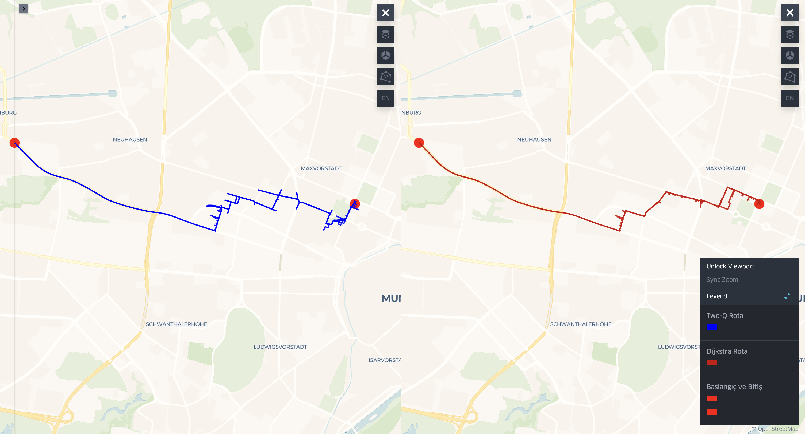

# **Project: Map Visualization and Route Planning**  

This project uses OpenStreetMap (OSM) data to perform map visualization and route planning. It is developed using Python and the KeplerGL library.  

## **Features**  
- Load and process OSM data.  
- Plan routes using the shortest path algorithm (Two-Q and Dijkstra).  
- Visualize routes on a map and save as an HTML file.  
- Compare the results of multiple shortest path algorithms.  

## **About**  
This project is entirely developed in Python, with the output being an interactive HTML file. The HTML file is generated using the KeplerGL library, which allows for dynamic and interactive map visualizations. The project demonstrates how to:  
- Load and process geographic data.  
- Implement shortest path algorithms (Two-Q and Dijkstra).  
- Visualize the results on an interactive map (KeplerGL).  

The output HTML file is lightweight and can be easily shared or embedded in web applications. The project is designed to be modular and extensible, making it easy to adapt for different use cases.

## **Terminal Output**
When the project is run, it produces an output in the terminal as shown below. This output includes steps such as loading OSM data, performing graph projection, running the Two-Q and Dijkstra algorithms, and saving the results.

```bash
Loading OSM data...
Performing graph projection...
Two-Q Algorithm Running:  37%|███▎     | 15.3k/40.9k [07:54<11:16, 37.8it/s]
Target node reached: 297265330

Dijkstra Algorithm Running:   0%|              | 0.00/40.9k [00:00<?, ?it/s]
Target node reached: 297265330

Route found by Two-Q Algorithm:
Route Length: 64 nodes
Route: [2349278103, 2349278105, 8748689408, 1907449212, 618702521, 967091779, 967091696, 967091718, 967091769, 967091720, 967091793, 922831062, 303455222, 3221897641, 3221897640, 303455185, 4372463190, 303455186, 303455217, 1644932680, 1907449199, 1907449198, 4372462285, 1907449200, 1907449184, 1907449189, 990261377, 2652170244, 2652170251, 2652170268, 2652170269, 2652170275, 2652170277, 2652170279, 4673563214, 2300979070, 2300979073, 2300979074, 1906159562, 1906159563, 1906159531, 4984671221, 4984671225, 4984671223, 818083379, 21326676, 19404294, 715297388, 1659974592, 21924911, 201418037, 1906159447, 1502862322, 21924914, 6071582320, 201416172, 2475788296, 6071582319, 737219006, 302721333, 19404292, 322027001, 3757114326, 297265330]
Route found by Dijkstra Algorithm:
Route Length: 82 nodes
Route: [2349278103, 2349278105, 3953206284, 3953206285, 3953206287, 3953206290, 3953206291, 3953206292, 3953206293, 3769569361, 3769568995, 3953206295, 3953206294, 2269419707, 8748885627, 8748885657, 2269137872, 8748885671, 2269137874, 8748885663, 1290733319, 1077566390, 1077566374, 1840947345, 1362827597, 3956480122, 1290732959, 1290733344, 3785911588, 3997354937, 1077566595, 1077566562, 1077566167, 3017699266, 788021897, 774634208, 3463306447, 3463306451, 1106648595, 4464804310, 3573856577, 4464804302, 3393433210, 4464804391, 1077566483, 774634149, 1077566677, 1145362835, 2734171681, 2966573105, 2966573106, 2966573108, 774634127, 2734171704, 363192, 363191, 3809858759, 21632160, 4268520832, 3700240481, 818083375, 21326677, 363189, 1659974455, 7002654723, 6209749146, 1659974592, 21924911, 201418037, 1906159447, 1502862322, 21924914, 6071582320, 201416172, 2475788296, 6071582319, 737219006, 302721333, 19404292, 322027001, 3757114326, 297265330]
Algorithm comparison saved to outputs/algorithm_comparison.txt
Applying config configuration...
User Guide: https://docs.kepler.gl/docs/keplergl-jupyter
Saving HTML file: outputs/dual_path_visualization.html
Map saved to outputs/dual_path_visualization.html!
Visualization result saved as 'outputs/dual_path_visualization.html'.
```

## **Algorithm Result Comparison**  
The project now supports a structured comparison between multiple shortest path algorithms. The following algorithms are implemented:  
- **Two-Q Algorithm**: A custom shortest path algorithm optimized for large networks.  
- **Dijkstra's Algorithm**: A classic shortest path algorithm for weighted graphs.  

The comparison includes:  
- Route length (number of nodes).  
- Execution time.  
- Visualization of both routes on a dual-view map.  

Below is the performance comparison between the Two-Q and Dijkstra algorithms:

```bash
Algorithm Comparison Report 

Two-Q Algorithm:
    - Route Length: 33 nodes
    - Route Distance: 9088.33 meters
    - Walking Time: 6491.66 seconds (108.19 minutes)
    - Execution Time: 224.28 seconds
    - Efficiency: Needs Improvement

Dijkstra Algorithm:
    - Route Length: 82 nodes
    - Route Distance: 4963.62 meters
    - Walking Time: 3545.45 seconds (59.09 minutes)
    - Execution Time: 1.63 seconds
    - Efficiency: Excellent

Winner: Dijkstra

Summary:
    - Two-Q is slower than Dijkstra.
    - Two-Q found a longer route.
    - Two-Q has a longer walking time.
```

## Map Visualization

Below is the visualization of the routes found by the Two-Q and Dijkstra algorithms on the map.




## Running with Docker  

You can run this project in a Docker container to ensure consistency across environments. Follow these steps:  

### Build the Docker Image  

Before running the container, build the image using:  

```bash
docker build -t map-visualization.
```

### Run the Container  
Once the build is complete, run the container:  

```bash
docker run -p 8050:8050 --name map-container map-visualization
```

## Future Improvements  

- **Integrate Google Maps Live Traffic API:** Enhance the route planning functionality by integrating the Google Maps Live Traffic API.
 
- **Manual Start and End Point Selection:** EImplement a feature that allows users to manually select start and end points on the map. This will provide more flexibility and control over the route planning process, enabling users to customize their routes based on specific needs or preferences.
 
 - **Load New OSM Data Dynamically:** Add functionality to load new OpenStreetMap (OSM) data dynamically.
 


